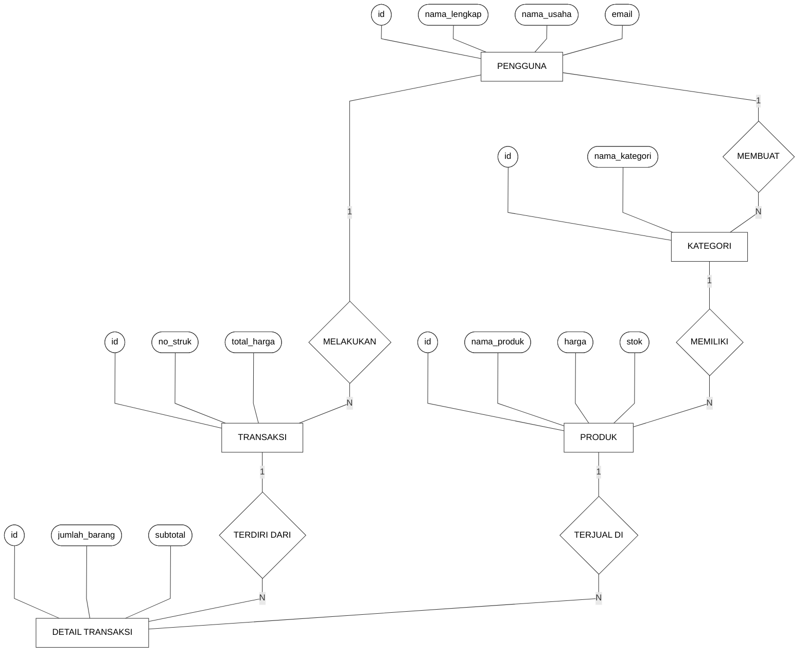
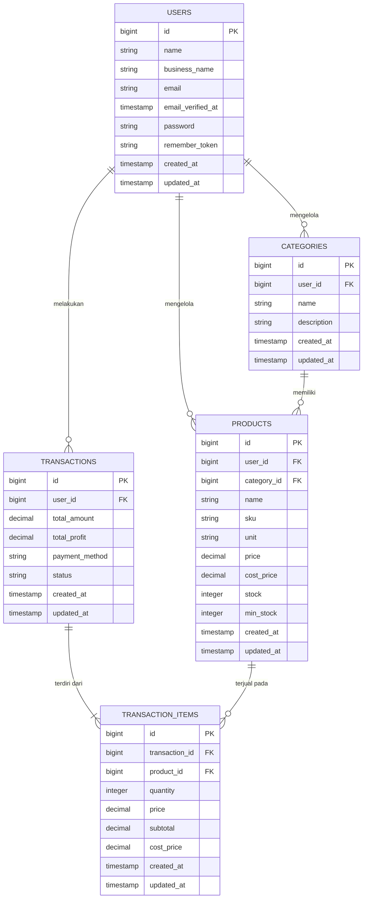
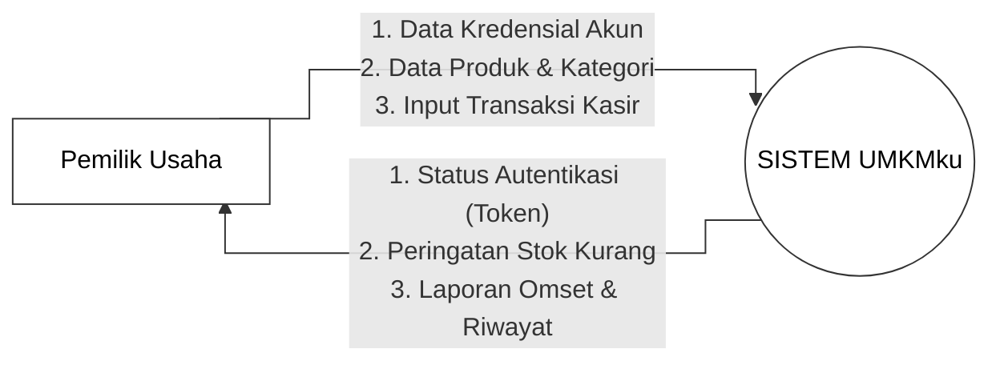
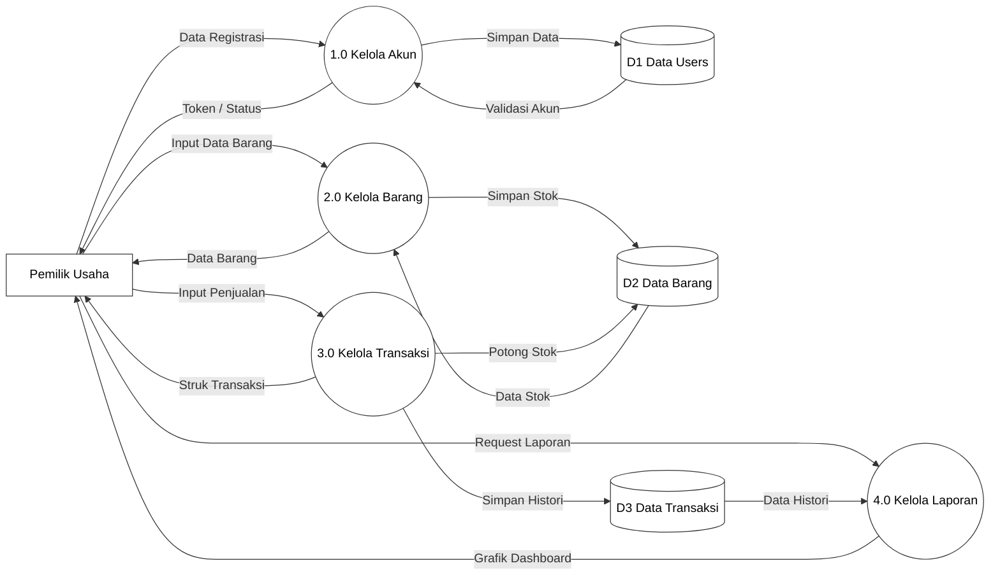
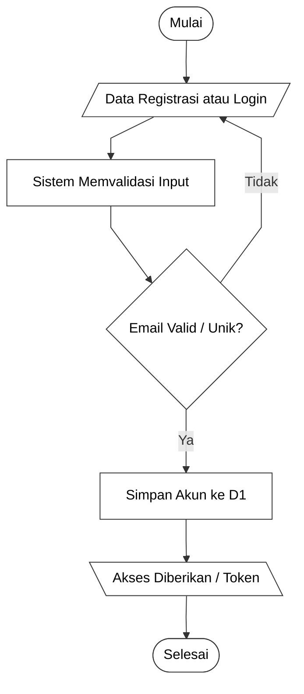
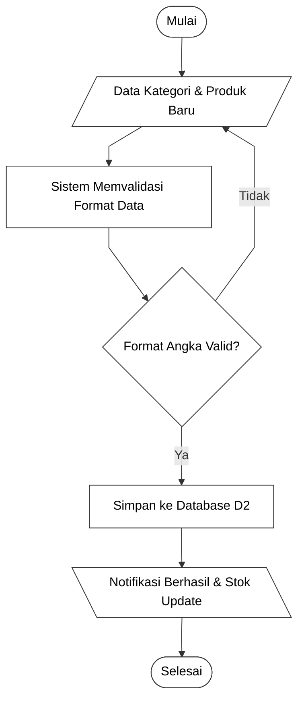
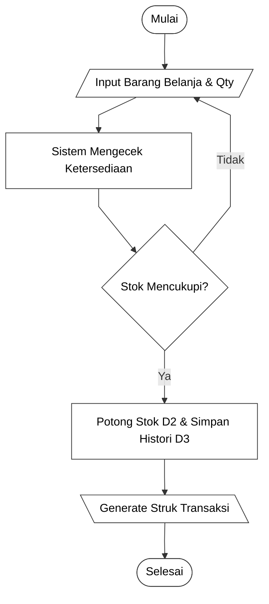
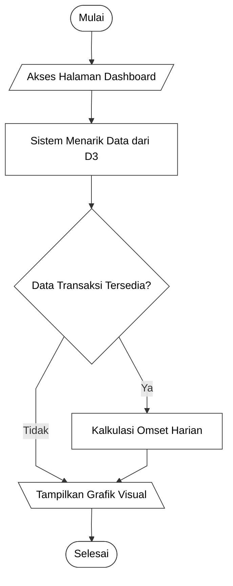

# DOKUMENTASI ANALISIS KEBUTUHAN PERANGKAT LUNAK

<table>
  <tr>
    <td width="25%"><b>DIBUAT UNTUK</b></td>
    <td width="5%">:</td>
    <td width="70%">Aplikasi Pencatatan Stok, Penjualan Kasir, dan Pemantauan Arus Kas Harian</td>
  </tr>
  <tr>
    <td><b>DIBUAT OLEH</b></td>
    <td>:</td>
    <td>
      Kelompok 2  
      1. RD. Fariz Nur Syawaluddin (10124445) 
      2. Mohamad Rifaldy Firdaus (10123095) 
      3. Farhan Farel Nauli Tanjung (10124347) 
      4. Muhammad Faiz Rizqullah (10124330) 
      5. Rasyid Kusuma (10124335)
    </td>
  </tr>
  <tr>
    <td><b>NAMA SOFTWARE</b></td>
    <td>:</td>
    <td>UMKMku</td>
  </tr>
</table>

## VERSI DOKUMEN

<table>
  <tr>
    <td width="25%"><b>Versi</b></td>
    <td width="5%">:</td>
    <td width="70%">1.0</td>
  </tr>
  <tr>
    <td><b>Tanggal</b></td>
    <td>:</td>
    <td>2 Agustus 2026</td>
  </tr>
  <tr>
    <td><b>Divalidasi oleh</b></td>
    <td>:</td>
    <td>RD. Fariz Nur Syawaluddin</td>
  </tr>
  <tr>
    <td><b>Tanda Tangan</b></td>
    <td>:</td>
    <td>   </td>
  </tr>
</table>

 

---

## ANALISIS DATA

### 1. Identifikasi Data

| Nomor Data | Nama Data | Atribut | Keterangan |
| :--- | :--- | :--- | :--- |
| **Dt-01** | Data Pengguna (Users) | `id`, `name`, `business_name`, `email`, `password` | Data autentikasi dan identitas pemilik usaha yang mengelola sistem. |
| **Dt-02** | Data Kategori | `id`, `user_id`, `name`, `description` | Data klasifikasi kelompok produk yang dibuat oleh pengguna. |
| **Dt-03** | Data Produk | `id`, `user_id`, `category_id`, `name`, `price`, `stock` | Data master barang yang dijual di kasir, memuat harga dan ketersediaan stok fisik. |
| **Dt-04** | Data Transaksi | `id`, `user_id`, `receipt_number`, `total_amount`, `payment_method`, `created_at` | Data rekam jejak penjualan (nota) beserta total pendapatan per transaksi. |
| **Dt-05** | Data Item Transaksi | `id`, `transaction_id`, `product_id`, `quantity`, `price`, `subtotal` | Data rincian barang apa saja yang dibeli pada satu transaksi tertentu. |

### 2. Pemodelan Data (ERD)

**Gambar 1: Model ER Konseptual (Chen's Notation)**

**Gambar 2: Diagram Relasi Database (Physical Data Model)**

 

---

## ANALISIS KEBUTUHAN FUNGSIONAL

### 1. Identifikasi Kebutuhan Fungsional

| Kode Kebutuhan | Deskripsi Kebutuhan |
| :--- | :--- |
| **KK-1** | Sistem harus dapat memfasilitasi pembuatan akun baru (Registrasi), proses masuk (Login), dan menghapus akun beserta seluruh data relasinya secara permanen. |
| **KK-2** | Pemilik Usaha dapat melakukan pencatatan, pembaruan, dan penghapusan terhadap data Kategori Barang dan Data Produk secara terstruktur. |
| **KK-3** | Sistem harus menyediakan antarmuka Kasir (POS) yang mampu menghitung total belanja dan memotong stok produk secara otomatis saat transaksi berhasil. |
| **KK-4** | Sistem harus mampu merekapitulasi riwayat transaksi harian dan menyajikannya dalam bentuk laporan grafik analitik (Dashboard). |

### 2. Diagram Konteks

**Gambar 2: Diagram Konteks (Context Diagram)**

### 3. Data Flow Diagram (DFD Level 0)

**Gambar 3: DFD Level 0**

### 4. Spesifikasi Proses

#### PROSES 1.0 - Kelola Akun & Autentikasi
<table>
  <tr><td width="25%"><b>No Urut.</b></td><td width="25%"><b>Proses</b></td><td width="50%"><b>Keterangan</b></td></tr>
  <tr><td rowspan="7"><b>PROSES 1</b></td><td><b>No. Proses</b></td><td>1.0</td></tr>
  <tr><td><b>Nama Proses</b></td><td>Kelola Akun & Autentikasi Pengguna</td></tr>
  <tr><td><b>Source (sumber)</b></td><td>Pemilik Usaha (User)</td></tr>
  <tr><td><b>Input</b></td><td>Data Registrasi (Email, Kata Sandi, Nama Usaha)</td></tr>
  <tr><td><b>Output</b></td><td>Akses masuk sistem (Token) atau Peringatan Error</td></tr>
  <tr><td><b>Destination (tujuan)</b></td><td>D1 Data Users, Pemilik Usaha</td></tr>
  <tr>
    <td><b>Logika Proses</b></td>
    <td>1. User menginput form registrasi/login. 2. Sistem memvalidasi ketersediaan email di D1. 3. Jika valid, sistem menyimpan data ke D1. 4. Sistem menampilkan status berhasil dan memberikan akses (Token).</td>
  </tr>
</table>

**Flowchart Proses 1**

 

#### PROSES 2.0 - Kelola Barang & Kategori
<table>
  <tr><td width="25%"><b>No Urut.</b></td><td width="25%"><b>Proses</b></td><td width="50%"><b>Keterangan</b></td></tr>
  <tr><td rowspan="7"><b>PROSES 2</b></td><td><b>No. Proses</b></td><td>2.0</td></tr>
  <tr><td><b>Nama Proses</b></td><td>Kelola Data Barang & Kategori</td></tr>
  <tr><td><b>Source (sumber)</b></td><td>Pemilik Usaha (User)</td></tr>
  <tr><td><b>Input</b></td><td>Data Kategori dan Data Produk (Harga, Stok)</td></tr>
  <tr><td><b>Output</b></td><td>Ketersediaan stok dan data barang ter-update</td></tr>
  <tr><td><b>Destination (tujuan)</b></td><td>D2 Data Kategori & Produk, Pemilik Usaha</td></tr>
  <tr>
    <td><b>Logika Proses</b></td>
    <td>1. User menginput data kategori atau produk baru. 2. Sistem memvalidasi format angka (harga/stok). 3. Sistem menyimpan data ke D2. 4. Sistem menampilkan notifikasi produk berhasil ditambahkan.</td>
  </tr>
</table>

**Flowchart Proses 2**

 

#### PROSES 3.0 - Kelola Transaksi Kasir
<table>
  <tr><td width="25%"><b>No Urut.</b></td><td width="25%"><b>Proses</b></td><td width="50%"><b>Keterangan</b></td></tr>
  <tr><td rowspan="7"><b>PROSES 3</b></td><td><b>No. Proses</b></td><td>3.0</td></tr>
  <tr><td><b>Nama Proses</b></td><td>Kelola Transaksi Kasir POS</td></tr>
  <tr><td><b>Source (sumber)</b></td><td>Pemilik Usaha (User)</td></tr>
  <tr><td><b>Input</b></td><td>Pilihan produk dan kuantitas (Qty) belanja</td></tr>
  <tr><td><b>Output</b></td><td>Pengurangan stok di D2, Pencatatan riwayat di D3</td></tr>
  <tr><td><b>Destination (tujuan)</b></td><td>D2 Data Produk, D3 Data Transaksi, Pemilik Usaha</td></tr>
  <tr>
    <td><b>Logika Proses</b></td>
    <td>1. User memilih produk untuk dijual. 2. Sistem mengecek ketersediaan stok fisik di D2. 3. Sistem menjumlahkan total tagihan otomatis. 4. Setelah dibayar, sistem memotong stok D2 dan mencatat histori penjualan ke D3.</td>
  </tr>
</table>

**Flowchart Proses 3**

 

#### PROSES 4.0 - Kelola Laporan & Dashboard
<table>
  <tr><td width="25%"><b>No Urut.</b></td><td width="25%"><b>Proses</b></td><td width="50%"><b>Keterangan</b></td></tr>
  <tr><td rowspan="7"><b>PROSES 4</b></td><td><b>No. Proses</b></td><td>4.0</td></tr>
  <tr><td><b>Nama Proses</b></td><td>Kelola Laporan Analitik & Dashboard</td></tr>
  <tr><td><b>Source (sumber)</b></td><td>D3 Data Transaksi</td></tr>
  <tr><td><b>Input</b></td><td>Permintaan akses laporan dari User</td></tr>
  <tr><td><b>Output</b></td><td>Grafik omset harian dan daftar riwayat transaksi</td></tr>
  <tr><td><b>Destination (tujuan)</b></td><td>Pemilik Usaha (User)</td></tr>
  <tr>
    <td><b>Logika Proses</b></td>
    <td>1. User membuka halaman Dashboard. 2. Sistem mengambil data rekapitulasi penjualan dari D3. 3. Sistem mengkalkulasi total omset dan jumlah produk terjual. 4. Laporan disajikan dalam bentuk antarmuka visual grafik/tabel.</td>
  </tr>
</table>

**Flowchart Proses 4**

### 5. Kamus Data

| Nama | Data Produk |
| :--- | :--- |
| **Where used / how used** | Proses 2.0 Kelola Data Barang & Kategori |
| **Deskripsi** | Menyimpan informasi master barang yang akan dijual di kasir. |
| **Struktur Data** | `id` + `user_id` + `category_id` + `name` + `sku` + `unit` + `price` + `cost_price` + `stock` + `min_stock` + `timestamps` |
| **Penjelasan per struktur data** | `id` = [Integer] Auto Increment PK `user_id` = [Integer] Relasi Pemilik `category_id` = [Integer] Relasi Kategori `name` = [String] Nama Barang `sku` = [String] Kode SKU `unit` = [String] Satuan Barang `price` = [Decimal] Harga Jual `cost_price` = [Decimal] Harga Modal `stock` = [Integer] Stok Tersedia `min_stock` = [Integer] Batas Minimum Stok |

 

---

## ANALISIS KEBUTUHAN NON FUNGSIONAL

### 1. Analisis Kebutuhan Perangkat Lunak

**a. Perangkat lunak yang ada di sistem berjalan (Fakta)**
| No | Nama Perangkat Lunak | Spesifikasi yang ada |
| :--- | :--- | :--- |
| 1 | Sistem Operasi | Windows 10 / 11 |
| 2 | Browser | Google Chrome / Microsoft Edge |
| 3 | Code Editor | Visual Studio Code |

**b. Kebutuhan minimum perangkat lunak**
| No | Nama Perangkat Lunak | Spesifikasi minimum |
| :--- | :--- | :--- |
| 1 | Sistem Operasi | Windows, macOS, atau Linux (Bebas) |
| 2 | Browser | Google Chrome, Safari, Firefox (Modern Browser) |
| 3 | Kebutuhan Jaringan | Akses Internet Stabil (Aplikasi Cloud-based) |

**c. Kesimpulan:**
Karena UMKMku telah dideploy secara penuh ke Cloud (Vercel, Render, Aiven), pengguna akhir (Pemilik Usaha) tidak memerlukan instalasi *web server* lokal (XAMPP) maupun *database*. Selama pengguna memiliki *modern browser* dan koneksi internet, aplikasi dapat langsung digunakan.

### 2. Analisis Kebutuhan Perangkat Keras

**a. Perangkat keras yang ada di sistem berjalan**
| No | Nama Perangkat Keras | Spesifikasi yang ada |
| :--- | :--- | :--- |
| 1 | Laptop / PC | Prosesor standar, RAM minimal 4 GB |
| 2 | Perangkat Jaringan | Modem / Wi-Fi Router |
| 3 | Handphone | Smartphone iOS / Android |

**b. Kebutuhan minimum perangkat keras**
| No | Nama Perangkat Keras | Spesifikasi minimum |
| :--- | :--- | :--- |
| 1 | Laptop / Tablet / HP | Perangkat apa pun yang memiliki layar dan peramban web (browser). |
| 2 | Perangkat Jaringan | Koneksi seluler atau Wi-Fi standar. |

**c. Kesimpulan:**
Sistem berbasis antarmuka web yang sangat ringan dan responsif. Tidak dibutuhkan pengadaan perangkat keras (hardware) khusus seperti komputer kasir ber-spesifikasi tinggi, karena aplikasi berjalan mulus di *smartphone* atau *laptop* biasa.

### 3. Analisis Kebutuhan Perangkat Pikir (Brainware)

**a. Perangkat Pikir yang ada di sistem berjalan**
| Stakeholder | Tanggung Jawab | Tingkat Pendidikan | Tingkat Keterampilan | Pengalaman Menggunakan Komputer |
| :--- | :--- | :--- | :--- | :--- |
| **Pemilik Usaha (User)** | Melakukan input data kategori, produk, transaksi penjualan, dan melihat laporan omset. | Minimal SMA / Sederajat | Mampu mengoperasikan aplikasi kasir sederhana dan mengakses browser internet. | Terbiasa menggunakan aplikasi di smartphone dan browser internet dasar. |

**b. Kebutuhan perangkat pikir**
| Pengguna Sistem | Hak Akses | Tingkat Keterampilan | Pengalaman Harus Dimiliki | Jenis Pelatihan yang Diberikan |
| :--- | :--- | :--- | :--- | :--- |
| **Pemilik Usaha (User)** | Akses Penuh (Manajemen Barang, Transaksi, Laporan, Akun) | Mampu mengoperasikan peramban web (*web browser*) di HP atau Laptop. | Pemahaman dasar tentang stok barang dan perhitungan jual beli. | Pelatihan cara menambahkan barang, memproses transaksi kasir, dan membaca grafik dashboard. |

**c. Kesimpulan:**
Sistem UMKMku dirancang dengan pendekatan *User-Friendly* dan *Minimalist*. Pemilik usaha tidak memerlukan kemampuan IT tingkat lanjut. Dengan keterampilan operasional HP/Komputer dasar, pengguna dapat langsung menjalankan operasional kasirnya secara efektif tanpa panduan yang rumit.
