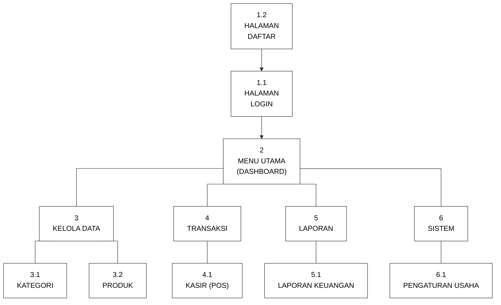
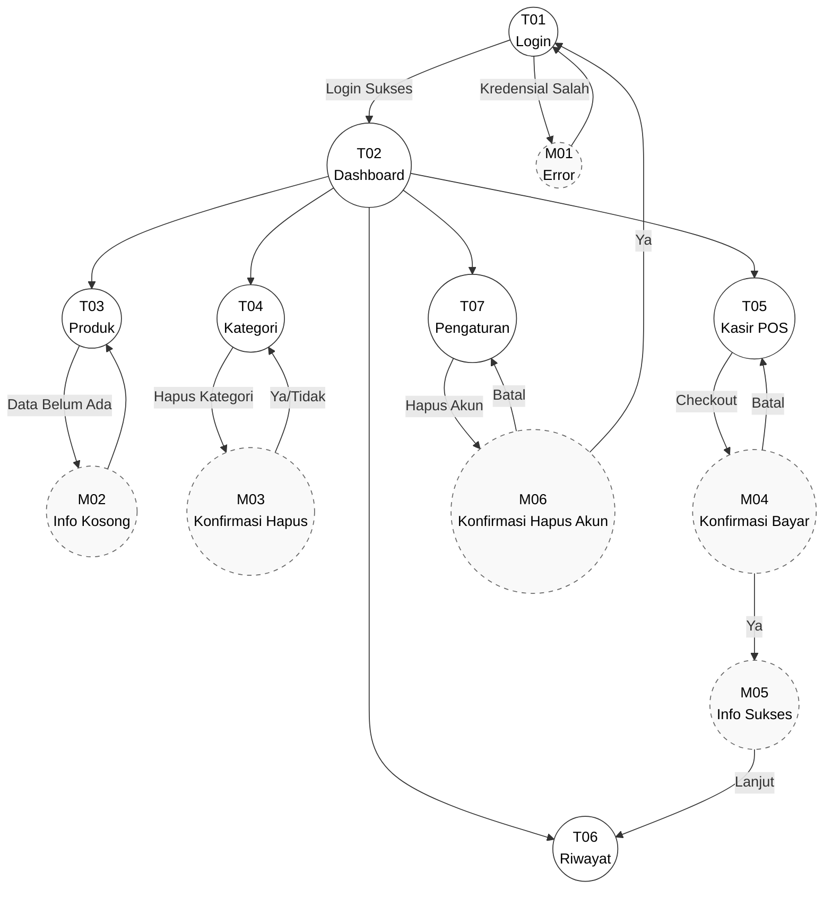

# DOKUMENTASI PERANCANGAN PERANGKAT LUNAK

<table>
  <tr>
    <td width="25%"><b>DIBUAT UNTUK</b></td>
    <td width="5%">:</td>
    <td width="70%">Memudahkan pengelolaan stok barang, pencatatan penjualan kasir, dan pemantauan arus kas secara terintegrasi bagi pelaku UMKM.</td>
  </tr>
  <tr>
    <td><b>DIBUAT OLEH</b></td>
    <td>:</td>
    <td>
      Kelompok 2  
      1. RD. Fariz Nur Syawaluddin (10124445) 
      2. Mohamad Rifaldy Firdaus (10123095) 
      3. Farhan Farel Nauli Tanjung (10124347) 
      4. Muhammad Faiz Rizqullah (10124330) 
      5. Rasyid Kusuma (10124335)
    </td>
  </tr>
  <tr>
    <td><b>NAMA SOFTWARE</b></td>
    <td>:</td>
    <td>UMKMku</td>
  </tr>
</table>

## VERSI DOKUMEN

<table>
  <tr>
    <td width="25%"><b>Versi</b></td>
    <td width="5%">:</td>
    <td width="70%">1.0</td>
  </tr>
  <tr>
    <td><b>Tanggal</b></td>
    <td>:</td>
    <td>2 Agustus 2026</td>
  </tr>
  <tr>
    <td><b>Divalidasi oleh</b></td>
    <td>:</td>
    <td>RD. Fariz Nur Syawaluddin</td>
  </tr>
  <tr>
    <td><b>Tanda Tangan</b></td>
    <td>:</td>
    <td>   </td>
  </tr>
</table>

 

---

## 1. PERANCANGAN DATA

Format Struktur Tabel:
`<Nomor> . <nama_tabel>`
Nama file : `<nama_tabel>.sql` Tempat penyimpanan: `<Cloud Database (PostgreSQL)>`

**<1> . <users>**
Nama file : `<users>.sql` Tempat penyimpanan: `<Cloud Database (PostgreSQL)>`
| Nama Field | Tipe Data | Panjang | Kunci | Keterangan |
| :--- | :--- | :--- | :--- | :--- |
| id | BIGINT | 20 | Primary Key | Kode unik pengguna |
| name | VARCHAR | 255 | - | Nama lengkap pengguna |
| business_name | VARCHAR | 255 | - | Nama usaha / toko |
| email | VARCHAR | 255 | - | Alamat email (unik) |
| email_verified_at | TIMESTAMP | - | - | Waktu verifikasi email |
| password | VARCHAR | 255 | - | Kata sandi (terenkripsi) |
| remember_token | VARCHAR | 100 | - | Token sesi (opsional) |
| created_at | TIMESTAMP | - | - | Waktu data dibuat |
| updated_at | TIMESTAMP | - | - | Waktu data diupdate |

**<2> . <categories>**
Nama file : `<categories>.sql` Tempat penyimpanan: `<Cloud Database (PostgreSQL)>`
| Nama Field | Tipe Data | Panjang | Kunci | Keterangan |
| :--- | :--- | :--- | :--- | :--- |
| id | BIGINT | 20 | Primary Key | Kode unik kategori |
| user_id | BIGINT | 20 | Foreign Key &rarr; users.id | Relasi pemilik kategori |
| name | VARCHAR | 100 | - | Nama kategori |
| description | TEXT | - | - | Penjelasan kategori |
| created_at | TIMESTAMP | - | - | Waktu data dibuat |
| updated_at | TIMESTAMP | - | - | Waktu data diupdate |

**<3> . <products>**
Nama file : `<products>.sql` Tempat penyimpanan: `<Cloud Database (PostgreSQL)>`
| Nama Field | Tipe Data | Panjang | Kunci | Keterangan |
| :--- | :--- | :--- | :--- | :--- |
| id | BIGINT | 20 | Primary Key | Kode unik produk |
| user_id | BIGINT | 20 | Foreign Key &rarr; users.id | Relasi pemilik produk |
| name | VARCHAR | 100 | - | Nama produk |
| category_id | BIGINT | 20 | Foreign Key &rarr; categories.id | Relasi kategori produk |
| sku | VARCHAR | 255 | - | Kode unik/SKU produk |
| unit | VARCHAR | 50 | - | Satuan produk (misal: pcs, pack) |
| price | DECIMAL | 12,2 | - | Harga jual produk |
| cost_price | DECIMAL | 12,2 | - | Harga modal produk |
| stock | INT | 11 | - | Jumlah ketersediaan stok fisik |
| min_stock | INT | 11 | - | Batas minimal stok untuk notifikasi |
| created_at | TIMESTAMP | - | - | Waktu data dibuat |
| updated_at | TIMESTAMP | - | - | Waktu data diupdate |

**<4> . <transactions>**
Nama file : `<transactions>.sql` Tempat penyimpanan: `<Cloud Database (PostgreSQL)>`
| Nama Field | Tipe Data | Panjang | Kunci | Keterangan |
| :--- | :--- | :--- | :--- | :--- |
| id | BIGINT | 20 | Primary Key | Kode unik transaksi |
| user_id | BIGINT | 20 | Foreign Key &rarr; users.id | Relasi kasir / pemilik toko |
| total_amount | DECIMAL | 15,2 | - | Total nilai belanja keseluruhan |
| total_profit | DECIMAL | 15,2 | - | Total keuntungan/laba dari transaksi |
| payment_method | ENUM | - | - | Metode pembayaran (Tunai, QRIS, Transfer) |
| status | ENUM | - | - | Status transaksi (Selesai, Pending, Batal) |
| created_at | TIMESTAMP | - | - | Waktu data dibuat |
| updated_at | TIMESTAMP | - | - | Waktu data diupdate |

**<5> . <transaction_items>**
Nama file : `<transaction_items>.sql` Tempat penyimpanan: `<Cloud Database (PostgreSQL)>`
| Nama Field | Tipe Data | Panjang | Kunci | Keterangan |
| :--- | :--- | :--- | :--- | :--- |
| id | BIGINT | 20 | Primary Key | Kode unik detail transaksi |
| transaction_id | BIGINT | 20 | Foreign Key &rarr; transactions.id | Induk dari struk/transaksi |
| product_id | BIGINT | 20 | Foreign Key &rarr; products.id | Produk yang dijual |
| quantity | INT | 11 | - | Jumlah (Qty) yang dibeli |
| price | DECIMAL | 12,2 | - | Harga satuan pada saat dibeli |
| subtotal | DECIMAL | 12,2 | - | Total harga (quantity * price) |
| cost_price | DECIMAL | 12,2 | - | Harga modal satuan saat dibeli |
| created_at | TIMESTAMP | - | - | Waktu data dibuat |
| updated_at | TIMESTAMP | - | - | Waktu data diupdate |

 

## 2. PERANCANGAN ARSITEKTUR MENU

Hierarchical or Sequential Menus

 

## 3. PERANCANGAN ANTARMUKA

*Catatan: Tangkapan layar (screenshot) prototipe halaman dapat diambil dengan membuka file HTML wireframe.*

### 1. Halaman Login
*(Silakan tempel Screenshot prototipe halaman Login di sini)*

### 2. Halaman Daftar (Registrasi)
*(Silakan tempel Screenshot prototipe halaman Daftar di sini)*

### 3. Halaman Dashboard (Menu Utama)
*(Silakan tempel Screenshot prototipe halaman Dashboard di sini)*

### 4. Halaman Manajemen Produk & Tambah Produk
*(Silakan tempel Screenshot prototipe halaman Manajemen Produk dan Modal Tambah Produk di sini)*

### 5. Halaman Transaksi Kasir (POS)
*(Silakan tempel Screenshot prototipe halaman Transaksi Kasir dan Modal Konfirmasi di sini)*

### 6. Halaman Laporan Keuangan & Cetak PDF
*(Silakan tempel Screenshot prototipe halaman Laporan dan Cetak di sini)*

### 7. Halaman Pengaturan Usaha & Hapus Akun
*(Silakan tempel Screenshot prototipe halaman Pengaturan dan Modal Hapus Akun di sini)*

 

## 4. PERANCANGAN PESAN

Dalam perancangan pesan terbagi menjadi beberapa bagian yaitu:
a. **No Pesan** diisi dengan nomor urut dalam membuat tampilan pesan.
b. **Logo Jenis Pesan** diisi dengan simbol atau gambar yang menyatakan jenis pesan tersebut.
c. **Jenis Pesan** diisi dengan nama jenis pesan yang akan ditampillkan. Contoh: konfirmasi, peringatan, informasi.
d. **Isi pesan** diisi dengan pertanyaan atau pernyataan yang akan disampaikan dalam tampilan ini.
e. **Tombol Sesuai Jenis Pesan** diisi dengan komponen tombol yang dapat dipilih oleh pengguna sebagai aksi dari pesan yang diberikan.

| No | Logo | Jenis Pesan | Isi Pesan | Tombol Sesuai Jenis Pesan |
| :--- | :--- | :--- | :--- | :--- |
| M01 | ⚠️ | Peringatan | Peringatan Stok Menipis! (Sisa 0 gls (Min: 10)) | `[ Habis ]` |
| M02 | ❓ | Konfirmasi | Apakah Anda yakin ingin menyelesaikan transaksi ini sebesar Rp 150.000 untuk 5 item? | `[ Batal ]` `[ Ya, Selesaikan ]` |
| M03 | ⚠️ | Peringatan / Hapus | Apakah Anda yakin ingin menghapus akun secara permanen? Semua data usaha... tidak dapat dikembalikan! | `[ Batal ]` `[ Ya, Hapus Akun ]` |

*(Catatan: Anda juga bisa menempelkan Screenshot prototipe kotak pesan / modal di bagian ini jika dosen meminta gambar visualnya)*

 

## 5. FORMAT JARINGAN SEMANTIK

Jaringan semantik adalah diagram yang menggambarkan aliran-aliran menu dan pesan dalam sebuah perangkat lunak.

Sebagai contoh jaringan semantik dalam perangkat lunak UMKMku adalah sebagai berikut:

