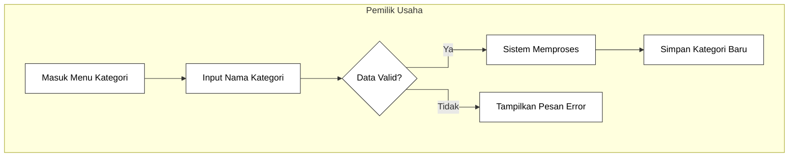
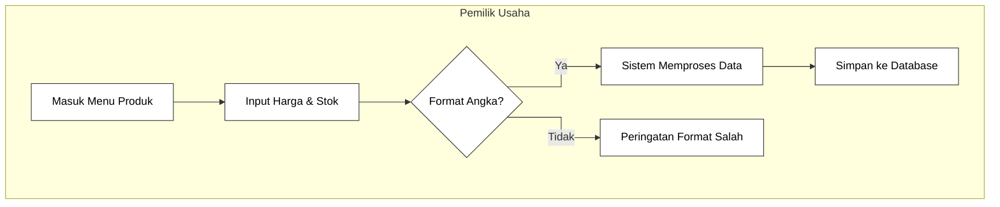
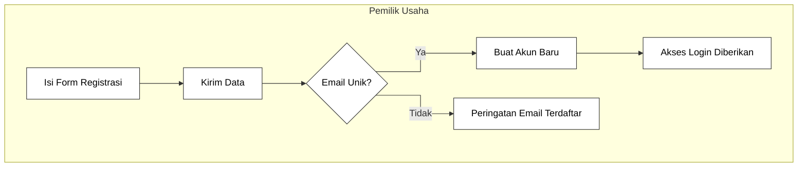
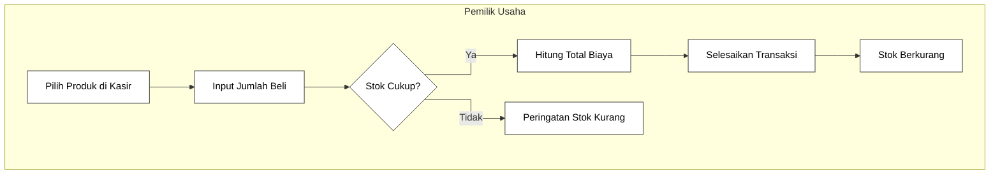
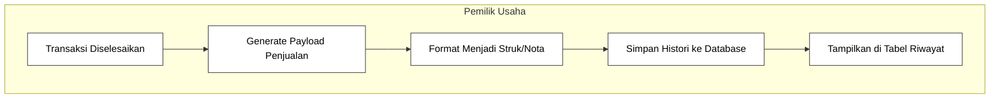
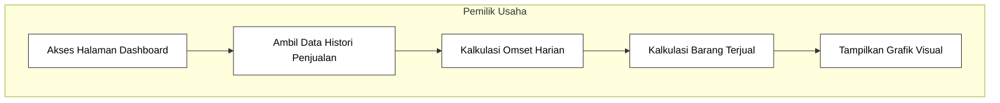

# DOKUMENTASI PROSES BISNIS

<table>
  <tr>
    <td width="25%"><b>DIBUAT UNTUK</b></td>
    <td width="5%">:</td>
    <td width="70%">Memudahkan pengelolaan stok barang, pencatatan penjualan kasir, dan pemantauan arus kas secara terintegrasi bagi pelaku UMKM.</td>
  </tr>
  <tr>
    <td><b>DIBUAT OLEH</b></td>
    <td>:</td>
    <td>
      Kelompok 2  
      1. RD. Fariz Nur Syawaluddin (10124445) 
      2. Mohamad Rifaldy Firdaus (10123095) 
      3. Farhan Farel Nauli Tanjung (10124347) 
      4. Muhammad Faiz Rizqullah (10124330) 
      5. Rasyid Kusuma (10124335)
    </td>
  </tr>
  <tr>
    <td><b>NAMA SOFTWARE</b></td>
    <td>:</td>
    <td>UMKMku</td>
  </tr>
</table>

## VERSI DOKUMEN

<table>
  <tr>
    <td width="25%"><b>Versi</b></td>
    <td width="5%">:</td>
    <td width="70%">1.0</td>
  </tr>
  <tr>
    <td><b>Tanggal</b></td>
    <td>:</td>
    <td>2 Agustus 2026</td>
  </tr>
  <tr>
    <td><b>Divalidasi oleh</b></td>
    <td>:</td>
    <td>RD. Fariz Nur Syawaluddin</td>
  </tr>
  <tr>
    <td><b>Tanda Tangan</b></td>
    <td>:</td>
    <td>   </td>
  </tr>
</table>

 

---

## DESKRIPSI PROSES BISNIS

| Nomor Proses | Nama Proses | Ruang Lingkup | Batasan | Input | Output |
| :--- | :--- | :--- | :--- | :--- | :--- |
| **PR-01** | Manajemen Kategori Produk | Proses pencatatan dan pengelompokan jenis barang agar lebih terstruktur. | Nama kategori tidak boleh kosong dan harus jelas. | - Nama & Deskripsi Kategori | Data kategori tersimpan di dalam database sistem. |
| **PR-02** | Pencatatan Data Produk & Stok | Proses penambahan produk baru beserta pembaruan informasi harga dan jumlah stok. | Harga dan stok harus berupa bilangan asli. Produk wajib dihubungkan ke salah satu kategori. | - Data produk (Nama, Harga, Stok, Kategori) | Data produk dan ketersediaan stok tersimpan di database. |
| **PR-03** | Manajemen Akun & Autentikasi Pengguna | Proses pendaftaran akun baru, validasi kredensial login, dan manajemen profil. | Alamat email pendaftaran harus unik. Jika dihapus, seluruh data pengguna akan terhapus. | - Nama Lengkap, Nama Usaha, Email, Kata Sandi | - Akses masuk sistem (Token) - Akun terhapus. |
| **PR-04** | Proses Transaksi Kasir POS | Proses operasional kasir untuk mencatat penjualan produk kepada pelanggan. | Jumlah produk yang dibeli tidak boleh melebihi ketersediaan stok di sistem. | - Pilihan produk yang dibeli - Jumlah (Qty) | Pengurangan jumlah stok produk secara otomatis. |
| **PR-05** | Pencatatan Riwayat Transaksi | Proses penyimpanan bukti pembayaran dan histori aktivitas penjualan setiap kali transaksi berhasil. | Hanya mencatat transaksi yang telah divalidasi dan berhasil dibayar pada PR-04. | - Data total harga dan list barang terjual | Catatan histori transaksi yang tidak bisa diubah (immutable). |
| **PR-06** | Pembuatan Laporan Analitik (Dashboard) | Proses sistem mengakumulasikan seluruh data penjualan menjadi ringkasan arus kas harian/bulanan. | Hanya menampilkan data omset dan transaksi yang dimiliki oleh akun yang sedang aktif. | - Data riwayat transaksi dari database | Laporan visual berupa total pendapatan (omset) dan barang terjual. |

 

---

## STAKEHOLDER

| Kode Stakeholder | Nama Stakeholder | Tanggung Jawab |
| :--- | :--- | :--- |
| **USR-1** | Pemilik Usaha (User) | 1. Melakukan pencatatan data produk dan kategori toko. 2. Melakukan input transaksi kasir saat ada penjualan. 3. Memantau laporan arus kas dan riwayat transaksi pada dashboard. 4. Menjaga kerahasiaan akun dan kata sandi aplikasi. |

 

---

## ALUR PROSES BISNIS

<table>
  <tr><td width="25%"><b>Nomor Proses</b></td><td width="5%">:</td><td width="70%">PR-01</td></tr>
  <tr><td><b>Nama Proses</b></td><td>:</td><td>Manajemen Kategori Produk</td></tr>
  <tr><td><b>Stakeholder Terkait</b></td><td>:</td><td>&lt;USR-1 Pemilik Usaha&gt;</td></tr>
  <tr>
    <td><b>Alur Proses</b></td>
    <td>:</td>
    <td>1. Pemilik Usaha masuk ke menu Kategori. 2. Memilih opsi Tambah Kategori Baru. 3. Menginputkan nama kategori barang. 4. Sistem memverifikasi input kosong. 5. Sistem menyimpan kategori ke database.</td>
  </tr>
  <tr><td><b>Visualisasi</b></td><td>:</td><td><i>(Lihat bagian visualisasi PR-01)</i></td></tr>
</table>

 

<table>
  <tr><td width="25%"><b>Nomor Proses</b></td><td width="5%">:</td><td width="70%">PR-02</td></tr>
  <tr><td><b>Nama Proses</b></td><td>:</td><td>Pencatatan Data Produk & Stok</td></tr>
  <tr><td><b>Stakeholder Terkait</b></td><td>:</td><td>&lt;USR-1 Pemilik Usaha&gt;</td></tr>
  <tr>
    <td><b>Alur Proses</b></td>
    <td>:</td>
    <td>1. Pemilik Usaha masuk ke menu Daftar Produk. 2. Mengisi detail produk (nama, harga, stok). 3. Memilih Kategori yang sudah dibuat di PR-01. 4. Sistem memverifikasi validitas format harga dan stok. 5. Sistem menyimpan produk ke database.</td>
  </tr>
  <tr><td><b>Visualisasi</b></td><td>:</td><td><i>(Lihat bagian visualisasi PR-02)</i></td></tr>
</table>

 

<table>
  <tr><td width="25%"><b>Nomor Proses</b></td><td width="5%">:</td><td width="70%">PR-03</td></tr>
  <tr><td><b>Nama Proses</b></td><td>:</td><td>Manajemen Akun & Autentikasi Pengguna</td></tr>
  <tr><td><b>Stakeholder Terkait</b></td><td>:</td><td>&lt;USR-1 Pemilik Usaha&gt;</td></tr>
  <tr>
    <td><b>Alur Proses</b></td>
    <td>:</td>
    <td>1. Pemilik Usaha mengisi form registrasi di halaman awal. 2. Sistem melakukan pengecekan ketersediaan email. 3. Jika email belum ada, sistem mengizinkan pembuatan akun. 4. Sistem memberikan akses Token (Login berhasil).</td>
  </tr>
  <tr><td><b>Visualisasi</b></td><td>:</td><td><i>(Lihat bagian visualisasi PR-03)</i></td></tr>
</table>

 

<table>
  <tr><td width="25%"><b>Nomor Proses</b></td><td width="5%">:</td><td width="70%">PR-04</td></tr>
  <tr><td><b>Nama Proses</b></td><td>:</td><td>Proses Transaksi Kasir POS</td></tr>
  <tr><td><b>Stakeholder Terkait</b></td><td>:</td><td>&lt;USR-1 Pemilik Usaha&gt;</td></tr>
  <tr>
    <td><b>Alur Proses</b></td>
    <td>:</td>
    <td>1. Pemilik Usaha membuka halaman Kasir (POS). 2. Memilih produk dan mengatur jumlah (qty) yang dibeli pelanggan. 3. Sistem mengecek ketersediaan stok fisik. 4. Sistem menjumlahkan total harga otomatis. 5. Transaksi diselesaikan dan stok dipotong.</td>
  </tr>
  <tr><td><b>Visualisasi</b></td><td>:</td><td><i>(Lihat bagian visualisasi PR-04)</i></td></tr>
</table>

 

<table>
  <tr><td width="25%"><b>Nomor Proses</b></td><td width="5%">:</td><td width="70%">PR-05</td></tr>
  <tr><td><b>Nama Proses</b></td><td>:</td><td>Pencatatan Riwayat Transaksi</td></tr>
  <tr><td><b>Stakeholder Terkait</b></td><td>:</td><td>&lt;USR-1 Pemilik Usaha&gt;</td></tr>
  <tr>
    <td><b>Alur Proses</b></td>
    <td>:</td>
    <td>1. Setelah PR-04 selesai, sistem menerima payload data penjualan. 2. Sistem memformat data menjadi struk digital (Histori). 3. Sistem menyimpan histori ke dalam tabel Transaksi. 4. Pemilik Usaha dapat meninjau riwayat ini kapan saja.</td>
  </tr>
  <tr><td><b>Visualisasi</b></td><td>:</td><td><i>(Lihat bagian visualisasi PR-05)</i></td></tr>
</table>

 

<table>
  <tr><td width="25%"><b>Nomor Proses</b></td><td width="5%">:</td><td width="70%">PR-06</td></tr>
  <tr><td><b>Nama Proses</b></td><td>:</td><td>Pembuatan Laporan Analitik (Dashboard)</td></tr>
  <tr><td><b>Stakeholder Terkait</b></td><td>:</td><td>&lt;USR-1 Pemilik Usaha&gt;</td></tr>
  <tr>
    <td><b>Alur Proses</b></td>
    <td>:</td>
    <td>1. Pemilik Usaha membuka halaman Dashboard. 2. Sistem mengambil kumpulan data dari histori transaksi. 3. Sistem melakukan kalkulasi total pendapatan (omset). 4. Laporan disajikan dalam bentuk antarmuka visual yang mudah dipahami.</td>
  </tr>
  <tr><td><b>Visualisasi</b></td><td>:</td><td><i>(Lihat bagian visualisasi PR-06)</i></td></tr>
</table>

 

---

## VISUALISASI PROSES BISNIS

### 1. Visualisasi `<PR-01>` - `<Manajemen Kategori Produk>`

### 2. Visualisasi `<PR-02>` - `<Pencatatan Data Produk & Stok>`

### 3. Visualisasi `<PR-03>` - `<Manajemen Akun & Autentikasi>`

### 4. Visualisasi `<PR-04>` - `<Proses Transaksi Kasir POS>`

### 5. Visualisasi `<PR-05>` - `<Pencatatan Riwayat Transaksi>`

### 6. Visualisasi `<PR-06>` - `<Pembuatan Laporan Analitik>`

